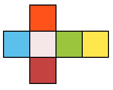
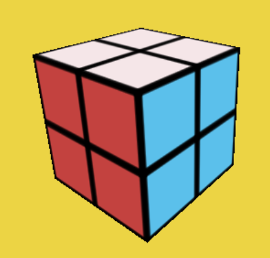
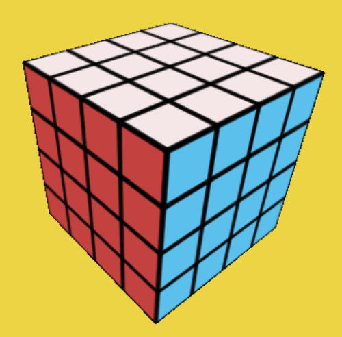
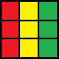
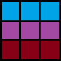

<h1 align="center">rubiks-it</h1>

<p align="center"> Open-Source Project using <b><a href="https://www.typescriptlang.org/">TypeScript</a></b>, <b><a href="https://threejs.org/docs/index.html#manual/en/introduction/Creating-a-scene)">Three.js</a></b> and <b><a href="https://sass-lang.com/">Scss</a></b>.</p>

<hr/>

## Introduction

I've got this idea by searching in my room for something I used to play with when I was young... and I found a easy Rubiks cube which was in 3x3

I wanted to make it possible to play with one virtually. So I came up with the idea of using [Three.js](https://threejs.org/docs/index.html#manual/en/introduction/Creating-a-scene) for this project because I already had some experience with it in the past with my other Open-Source project [cosmic-adventure](https://github.com/LelouchFR/cosmic-adventure).


## Dependencies

[Three.js](https://threejs.org/docs/index.html#manual/en/introduction/Creating-a-scene)
> `npm install three`

[Scss](https://sass-lang.com/)
> `npm install sass`

For the project to work: you will also need [NodeJs](https://nodejs.org/en) installed.

The project turn using the vite vanilla-ts

## How is it working

### 1. The colors of the cube

The variable `colors` which is a array of 6 numbers in hexadecimal form for the faces of the cube
```ts
let colors: number[] = [0xFF521B, 0xC3423F, 0xF5E6E8, 0xFDE74C, 0x5BC0EB, 0x9BC53D];
```


To show you how the cube is acting:
-  the **right** is the **orange**
-  the **left** is the **red**
-  the **top** is the **white**
-  the **bottom** is the **yellow**
-  the **front** is the **blue**
-  the **back** is the **green**

The array of the colors is **`[right, left, top, bottom, front, back]`**

The colors are set after with a simple variable named `cubeMaterials` which is a **array of THREE.MeshBasicMaterial**
```ts
let cubeMaterials: THREE.MeshBasicMaterial[] = [
    new THREE.MeshBasicMaterial({color: colors[0], map: texture}),
    new THREE.MeshBasicMaterial({color: colors[1], map: texture}),
    new THREE.MeshBasicMaterial({color: colors[2], map: texture}),
    new THREE.MeshBasicMaterial({color: colors[3], map: texture}),
    new THREE.MeshBasicMaterial({color: colors[4], map: texture}),
    new THREE.MeshBasicMaterial({color: colors[5], map: texture})
];
```

### 2. The Cube

The cube is made with help of **3 for loops** `i`, `j` and `k`. To place the cubes I use the `xPos`, `yPos` and `zPos`:
```ts
let [xPos, yPos, zPos]: number[] = [cubeSize * (i - 1), cubeSize * (j - 1), cubeSize * (k - 1)];
```
for the cubeGeometry, I used the variable `cubeSize` which is at 1:
```ts
let cubeGeometry: THREE.BoxGeometry = new THREE.BoxGeometry(cubeSize, cubeSize, cubeSize);
```
So if you want to change the size of the cube or you want to make it bigger you can use these 2 variables:
```ts
let cubeSize: number = 1;
let cubeCount: number = 3;
```
If you decrease the `cubeCount` to 2: it becomes a 2x2 rubiks cube.



If you increase the `cubeCount` to 4: it becomes a 4x4 rubiks cube.



For the the `cubeSize` variable it's to make simply the cube Bigger.


### 3. The Rotation

For the rotation I used 3 vectors:
- for the **X axis**
- for the **Y axis**
- for the **Z axis**

```ts
const [Vec1, Vec2, Vec3] = [new THREE.Vector3(turn, 0, 0), new THREE.Vector3(0, turn, 0), new THREE.Vector3(0, 0, turn)];
```
The `turn` argument from the function `CubeRotator()` can **only take** numbers which are **`1` or `-1`**

- If it's a **1**: the cube is rotation from **top to bottom if clicked on the upper arrow**
- If it's a **-1**: the cube is rotation from **bottom to top if clicked on the upper arrow**

To Move them they're put into variables: to show you how its mapped:



- The **red side** is called `leftCubesX`
- The **yellow side** is called `middleCubesX`
- The **green side** is called `rightCubesX`



- The **blue side** is called `rightCubesY`
- The **magenta side** is called `middleCubesY`
- The **dark red side** is called `leftCubesY`

The Z one are form the back the same combinations than red, yellow and green. He's never used.